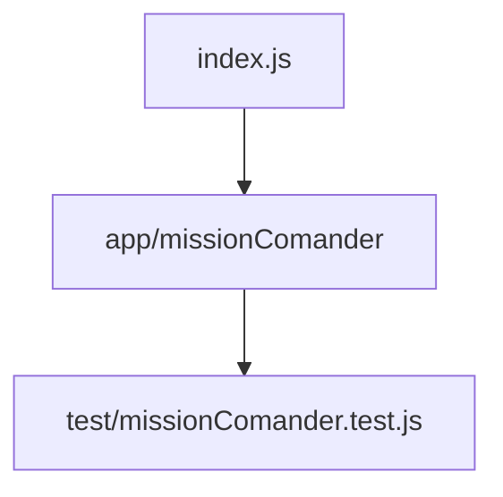

# my_launch_app
Primer proyecto de creación de JS
Ejercicio 1 de la semana 3 en LaunchX

## Lo que apredimos.
- Versionamiento del proyecto con Git.
- Organización de los folders y archivos a lo largo del proyecto. 
- Creación de package.jsony sus configuraciones. 
- Adición de las dependencias. 
- Creación del archivo `.gitignore` para evitar versionar node_modules.
- Introducción a las pruebas de unidad.

## Conexiones existentes en el proyecto.

## Dependecias 
- [Jest](https://jestjs.io/)
